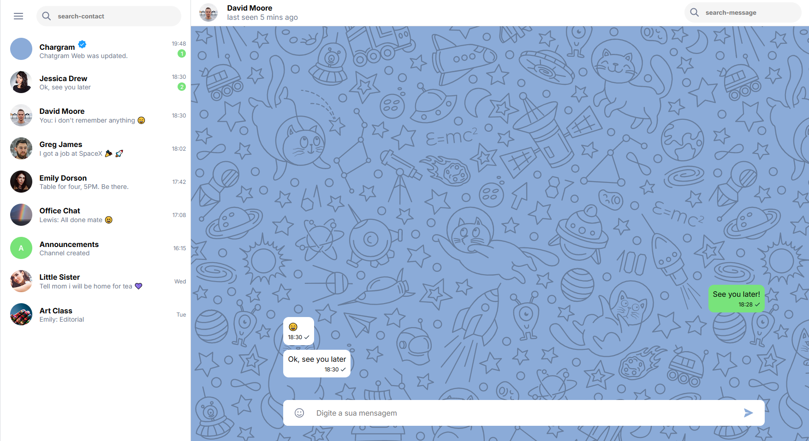

<!-- BANNER SUPERIOR -->
<div align="center">

# 💬 Chat Fake

Chat interface simulation that allows sending, displaying and filtering messages in a dynamic and interactive way.

[](https://chat-fake-taupe.vercel.app/)

</div>

---

## 📋 About the Project

This project is a chat interface simulation designed to replicate basic messaging features such as sending messages, displaying conversations, and filtering content.

The application dynamically updates the interface based on user interaction, providing a realistic chat experience.

The goal of this project was to practice **DOM manipulation**, **state handling**, and **interactive UI behavior**.

---

## 🛠️ Technologies Used

<div align="center">


</div>

---

## ✨ Features

- Send and display messages
- Dynamic message rendering
- Chat conversation layout
- Message filtering/search functionality
- Interactive user interface

---

## 📷 Preview

<div align="center">



</div>

---

## 🚀 Installation and Usage

### Step by step

```bash
# Clone the repository
git clone https://github.com/vilhegas/chat-fake.git

# Enter the project folder
cd chat-fake

# Open index.html in your browser
